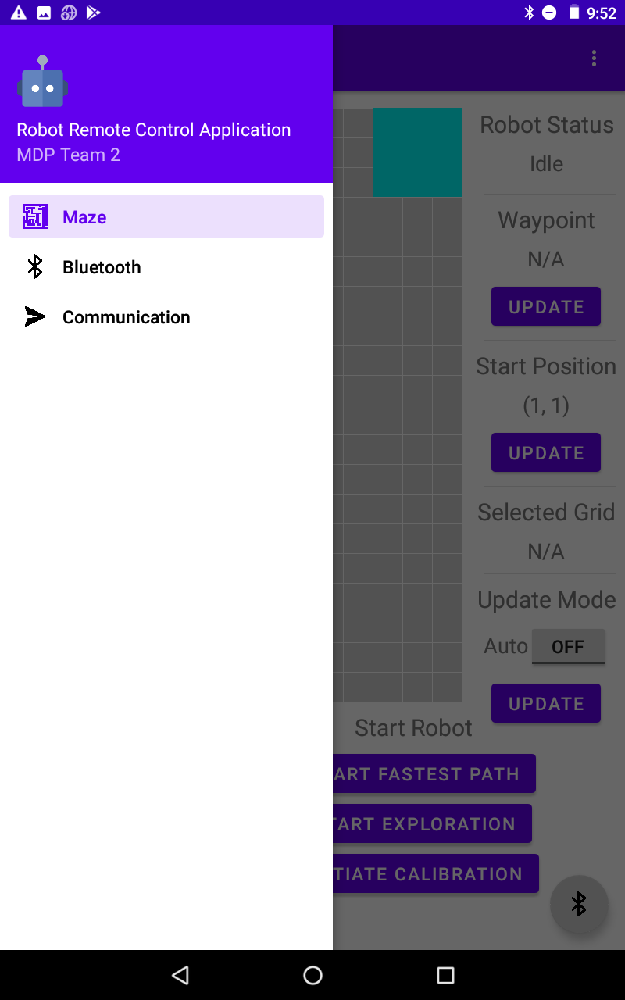
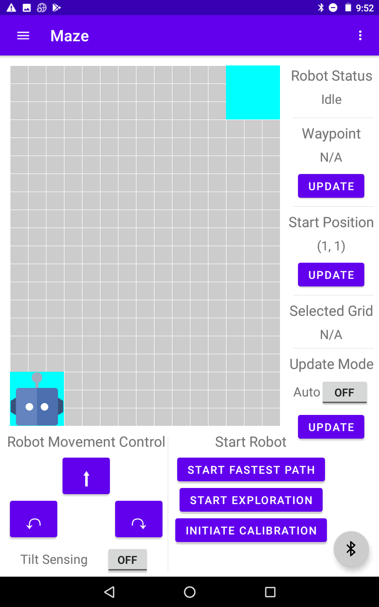
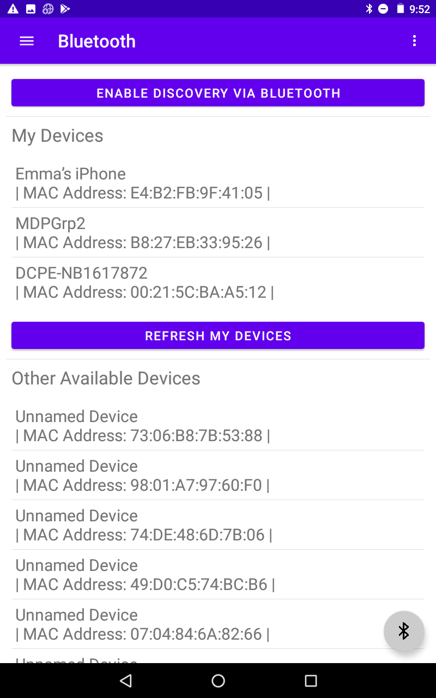
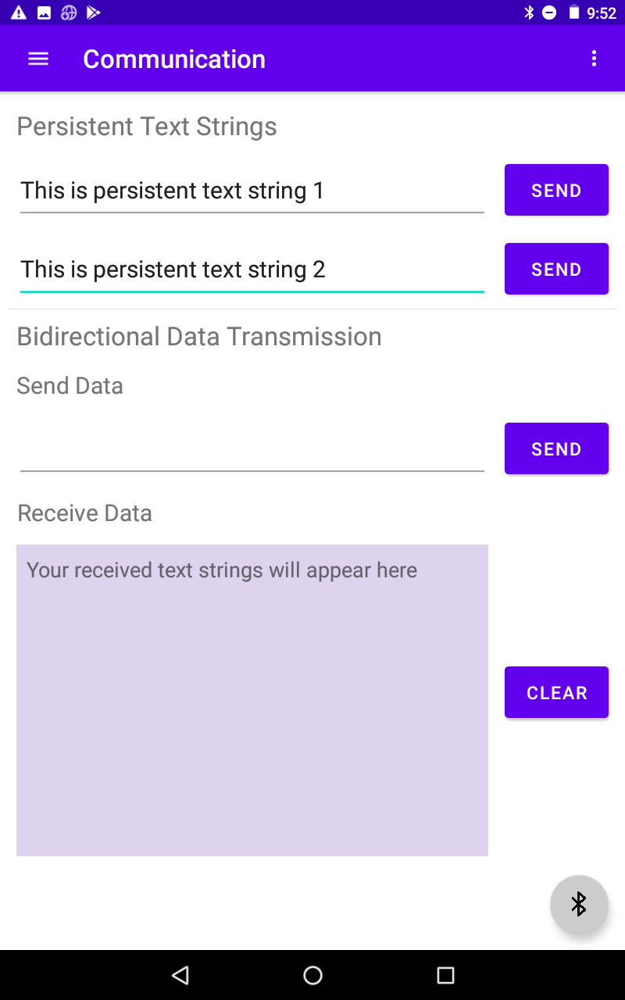

# Android Application

This repository contains the Android application implemented for Multi-Disciplinary Design Project AY2020/2021 Team 2.

## Overview

The Acer tablet with the Android application installed acts as a wireless remote controller for the team's MDP robotic system.
The application sends commands to other components of the system to start various tasks for assessment, initiate calibration, update waypoint position, control robot movement, and many more.
The current maze environment and robot status is visualized on the application interface.

The application is compiled on version Android 10 (API level 29) of Android SDK Platform.
It runs on a physical device with Bluetooth support.

## UI Design & Functionalities

**Navigation Menu**: The users may navigate different pages within application using the navigation menu:

**Maze Interface**: The maze interface displays the current maze environment:

The functionalities of the maze interface are listed as follows:

- The maze interface provides interactive control of the robot movement (move forward, turn left, turn right) in the 'Robot Movement Control' panel. User may tap on the buttons to control robot movement, or enable Tilt Sensing to control the robot by tilting the Android tablet.
- The maze interface indicates the current status of the robot (idle, running, calibrating, etc) in the 'Robot Status' text box.
- User may enter waypoint & robot start coordinates using Touch-the-Map based interaction. The user may select a grid in the map, and then tap the 'UPDATE' button for waypoint or start coordinates to update the values.
- The maze interface provides 2D display of the maze environment and the robot’s location.
- The maze interface provides the selection of Manual or Auto
updating of graphical display of the maze environment. Auto update mode can be turned on/off by toggling the ON/OFF button in the 'Update Mode' panel. When Auto update mode is turned off, tapping on the 'UPDATE' button triggers maze environment display update.
- The maze interface is able to display Number ID Blocks in the maze environment.
- User may start fastest path and exploration, and initiate calibration by tapping the buttons under the 'Start Robot' panel.

**Bluetooth Interface**: The Bluetooth interface is as below:

The functionalities of the Bluetooth interface are listed as follows:

- The application does not hang up if connectivity with the Bluetooth device is temporarily lost, and is able to re-establish connection automatically once the Bluetooth device initiates connection again.
- The floating action button at the bottom right corner indicates the current Bluetooth connection status. It's gray when there is no Bluetooth connection and cyan when a Bluetooth device is connected.
- User may enable the Android tablet to be discoverable via Bluetooth by other Bluetooth devices by tapping the 'ENABLE DISCOVERY VIA BLUETOOTH' button.
- The Bluetooth interface displays a list of devices previously paired with the Android tablet under 'My Devices'. User may refresh the list by tapping the 'REFRESH MY DEVICES' button.
- The Bluetooth interface scans nearby Bluetooth devices and displays the list of devices under 'Other Available Devices'.

**Communication Interface**: The communication interface is as below:

The functionalities of the communication interface are listed as follows:

- The communication interface transmits and receives text strings via Bluetooth. User may send text strings out and the received text strings will be displayed in the text box under 'Receive Data'.
- The communication interface supports sending persistent user reconfigurable string commands to the robot. Both text strings under 'Persistent Text Strings' are non-volatile and configurable by user.

## Communication Protocols

The Android application communicates with the Raspberry Pi subsystem following the following communication protocols:

| Functionality	| Android → RPi	| RPi → Android|
| ------------- | -------------- | ------------ |
| Robot Movement - Turn Left | L | ACK |
| Robot Movement - Turn Right | R | ACK |
| Robot Movement - Move Forward | M0 | ACK |
| Maze Display Update | UPDATE | ROBOT,IDLE/RUNNING/CALIBRATING/ARRIVED,0/90/180/270,X:Y;MDF,000011000...;IMAGE,X1:Y1:ID1,X2:Y2:ID2,...Xn:Yn:IDn |
| Send Start Point Location | START,X:Y | ACK |
| Send Waypoint Location | WAYPOINT,X:Y | ACK |
| Start Fastest Path | FP | ACK |
| Start Exploration | EXP | ACK |
| Initiate Calibration | C | ACK |

## Code Design & Implementation

The overall project structure is as follows:

- service
	- [BluetoothCommunicationService.java](MDPApplication/app/src/main/java/com/example/mdpapplication/service/BluetoothCommunicationService.java)
	- [BluetoothService.java](MDPApplication/app/src/main/java/com/example/mdpapplication/service/BluetoothService.java)
	- [Constants.java](MDPApplication/app/src/main/java/com/example/mdpapplication/service/Constants.java)
- ui
	- maze
		- [MazeFragment.java](MDPApplication/app/src/main/java/com/example/mdpapplication/ui/maze/MazeFragment.java)
		- [MazeView.java](MDPApplication/app/src/main/java/com/example/mdpapplication/ui/maze/MazeView.java)
	- bluetooth
		- [BluetoothFragment.java](MDPApplication/app/src/main/java/com/example/mdpapplication/ui/bluetooth/BluetoothFragment.java)
	- communication
		- [CommunicationFragment.java](MDPApplication/app/src/main/java/com/example/mdpapplication/ui/communication/CommunicationFragment.java)
- [MainActivity.java](MDPApplication/app/src/main/java/com/example/mdpapplication/MainActivity.java)

The project contains two Java packages, `service` and `ui`.

The `service` package contains the code needed for supporting Bluetooth connection and communication:

- The `BluetoothCommunicationService` class implements the general functionalities required for Bluetooth communication. It supports initiating connection to a remote device, checking connected remote device, sending out messages to the connected remote device, etc. This class does not interact directly with the classes in the `ui` package.
- The `BluetoothService` class implements the Bluetooth functionalities specific for the MDP robot remote control application. It supports connecting to a remote device, sending out messages to the connected remote device, and processing messages received via Bluetooth. This class interacts with the classes in the `ui` package.
- The `Constants` class defines the constants used in the `BluetoothCommunicationService` class and the `BluetoothService` class.

The `ui` package contains the code needed for rendering and updating the application UI display:

- The `maze` package: The `MazeFragment` class implements the maze interface based on [fragment_maze.xml](MDPApplication/app/src/main/res/layout/fragment_maze.xml) and manages all user interactions. The `MazeView` class renders the display of the grid map and manages user interactions on the grid map.
- The `bluetooth` package: The `BluetoothFragment` class implements the bluetooth interface based on [fragment_bluetooth.xml](MDPApplication/app/src/main/res/layout/fragment_bluetooth.xml) and manages all user interactions.
- The `communication` package: The `CommunicationFragment` class implements the communication interface based on [fragment_communication.xml](MDPApplication/app/src/main/res/layout/fragment_communication.xml) and manages all user interactions.

The `MainActivity` class implements the navigation menu and the floating action button indicating the application's current Bluetooth connection status.

## References

- Icons used in the application are downloaded from [https://icons8.com/](https://icons8.com/)
- The implementation of the `service` package references the [Android BluetoothChat Project](https://github.com/googlearchive/android-BluetoothChat) under The Android Open Source Project by Google
- Documentation on using Android Broadcasts is available on the [Android Developers](https://developer.android.com/guide/components/broadcasts) website
- This project is initialized with the [Navigation Drawer Activity](https://developer.android.com/studio/projects/templates#NavigationDrawer) template in [Android Studio](https://developer.android.com/studio)
